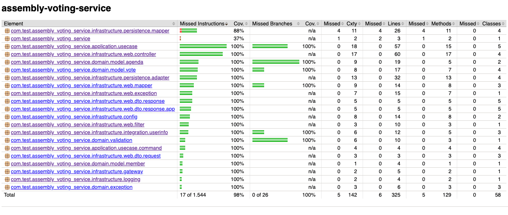

# Assembly Voting Service

## Objetivo do projeto
O objetivo deste projeto é fornecer uma solução backend (API REST) para gerenciar e participar de sessões de votação em assembleias de cooperativas, resolvendo o desafio técnico proposto.

No cooperativismo, cada associado possui um voto e as decisões são tomadas por votação. A solução atende às seguintes funcionalidades:
- **Cadastrar uma nova pauta.**
- **Abrir uma sessão de votação** em uma pauta (a sessão fica aberta por um tempo determinado na chamada ou por 1 minuto por *default*).
- **Receber votos** dos associados (opções 'Sim' ou 'Não'). Cada associado é identificado por um ID único e só pode votar uma vez por pauta.
- **Contabilizar os votos** e fornecer o resultado consolidado da votação (Aprovada ou Reprovada).

**Tarefas Bônus (NÃO IMPLEMENTADA TOTALMENTE):**
- **Integração com sistemas externos:** Validação da elegibilidade do associado para votar a partir do CPF através de integração HTTP (OpenFeign) com uma API externa.
- **Performance (Mensageria):** Arquitetura orientada a eventos e processamento assíncrono utilizando RabbitMQ (incluindo DLQ) para suportar cenários de centenas de milhares de votos de forma performática.
- **Versionamento da API:** Estratégia de versionamento na URI (ex: `/api/v1/...`).

## Documentação
Toda a documentação técnica, onde detalhamos os requisitos, o modelo de domínio, os endpoints e o fluxo do projeto pensados durante a concepção, está disponível em nossa pasta de refinamento.

👉 **[Acessar a pasta /docs com o refinamento](./docs)**

## Tecnologias utilizadas
A solução foi construída adotando padrões de *Clean Architecture/Arquitetura Hexagonal* e conta com as seguintes ferramentas e tecnologias:
- **Java 21**
- **Spring Boot**
- **Swagger (OpenAPI 3)** para documentação interativa
- **Lombok**
- **JUnit & Mockito & Jacoco Report** para cobertura de testes unitários automatizados
- **PostgreSQL** para persistência dos dados
- **Docker & Docker Compose**
- **RabbitMQ** para mensageria e processamento assíncrono **(Utilizaríamos, porém não conseguimos desenvolver a tempo)**

## Como subir o projeto

### 1. Subindo a infraestrutura
Utilizamos o Docker Compose para facilitar a inicialização de todas as dependências do projeto. Na raiz do repositório, execute:

```bash
docker-compose up -d
```

**O que irá subir?**
- **PostgreSQL:** Banco de dados relacional da aplicação rodando na porta local `5432`.
- **RabbitMQ:** Broker de mensageria rodando na porta `5672` (O painel de gerenciamento ficará acessível na porta `15672`).

### 2. Iniciando a Aplicação
Com os containers rodando, você pode subir o backend executando o comando (via terminal ou por sua IDE favorita):

```bash
./gradlew bootRun
```
A aplicação iniciará e estará escutando na porta **8080**.

Você pode acessar a interface do Swagger para visualizar todos os endpoints através da URL:
🔗 [http://localhost:8080/swagger-ui.html](http://localhost:8080/swagger-ui.html)

## Collection de testes
Para testar a aplicação de forma prática sem depender apenas do Swagger, adicionamos uma collection com todos os requests já configurados.

A collection para uso está localizada em: 
👉 **[docs/collection](./docs/collection)**

## Cobertura de teste
Para cobertura de teste utilizamos o JacocoReport e configuramos para gerar o relatório sempre que buildar o projeto

```bash
./gradlew clean build
```

O relatório é gerado em *build/reports/jacoco*.
Exemplo do relatório:

