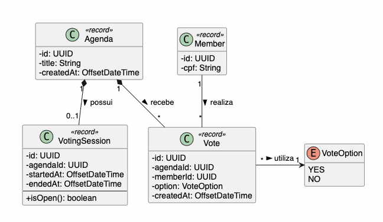
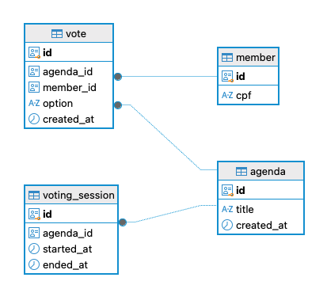

# Modelo de Domínio

## 1. Entidades

A solução será composta pelas seguintes entidades:

* `Agenda`: Representa a Pauta.
* `VotingSession`: Representa a sessão de votação que será aberta.
* `Vote`: Representa o voto do associado em uma pauta.
* `Member`: Representa o associado.

A entidade `Assembly` não fará parte do modelo persistido deste desafio. Ela será considerada um contexto de negócio existente.

O gerenciamento de `Member` também não faz parte do escopo. Os membros utilizados nos testes serão previamente inseridos através do Liquibase.

| Entidade        | Responsabilidade                                             | Principais atributos                                |
| --------------- | ------------------------------------------------------------ | --------------------------------------------------- |
| `Agenda`        | Representa a pauta que será submetido à votação.             | `id`, `title`, `createdAt`                          |
| `VotingSession` | Representa a sessão aberta em que a pauta pode receber votos | `id`, `agendaId`, `startedAt`, `endedAt`            |
| `Vote`          | Representa o voto de um associado em uma pauta               | `id`, `agendaId`, `memberId`, `option`, `createdAt` |
| `Member`        | Representa o associado                                       | `id`, `cpf`                                         |

---

## 2. Diagrama de Classes

O diagrama abaixo representa o modelo de domínio definido para a aplicação.



PlantUML
```
@startuml
!theme plain
skinparam classAttributeIconSize 0
hide empty methods

enum VoteOption {
    YES
    NO
}

class Agenda <<record>> {
    - id: UUID
    - title: String
    - createdAt: OffsetDateTime
}

class VotingSession <<record>> {
    - id: UUID
    - agendaId: UUID
    - startedAt: OffsetDateTime
    - endedAt: OffsetDateTime
    --
    + isOpen(): boolean
}

class Member <<record>> {
    - id: UUID
    - cpf: String
}

class Vote <<record>> {
    - id: UUID
    - agendaId: UUID
    - memberId: UUID
    - option: VoteOption
    - createdAt: OffsetDateTime
}

' Relacionamentos Conceituais
Agenda "1" *-- "0..1" VotingSession : possui >
Agenda "1" *-- "*" Vote : recebe >
Member "1" -- "*" Vote : realiza >
Vote "*" -right-> "1" VoteOption : utiliza >

@enduml
```

## 3. Diagrama Entidade-Relacionamento (DER)


